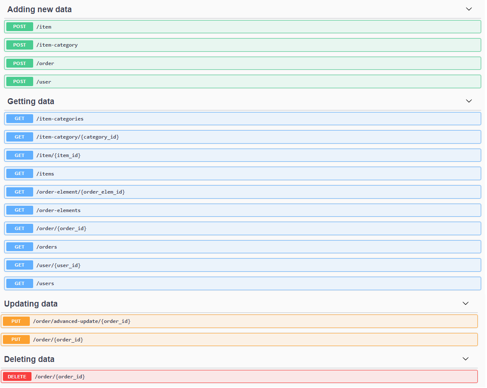

# shop-rest-api
#### Main assumptions:
1. There are already endpoints for signing up and obtaining some kind of
auth token. 
2. Security related issues are skipped. 
    * That is why user model has no password field.
    * It can be easily done with e.g. Flask-Login, Flask-User, Flask-JWT.
3. When the order is created, it has `date` field assigned automatically. This field cannot be changed.
4. Endpoints for filtering by some value (e.g. filter products by name or category, etc.) were skipped, since they were not part of the task. Nevertheless, they can be added very easily.
#### Functionalities:
1. **Creating** new items, item categories, users, **orders**.
2. **Listing** all users, **items**, item categories, **orders**, order elements.
3. Two ways of **updating an order**: basic and advanced.
4. **Deleting an order**.
#### Comments and less important assumptions:
1. The `id` field is assigned automatically for every entry in the database. Any POST request having `id` field specified in its body will be rejected.
2. Using SQLAlchemy library allows to use various dialects/databases.
3. There are the decorators, which enable some basic endpoints to be created easily. For example, all `GET` endpoints were created by the use of them. They make adding new endpoints faster and easier.
4. Thanks to distinction between models and resources, the API resources representation/implementation can be _detached_ from the database model. For example, both `orders` and `order_elements` tables compose the `/order` resource.
5. UI for basic documentation can be found under: `/api/docs/ui`.
#### Endpoints:

#### Examples:
##### 1. Adding new item category.   

**Request**  
Endpoint: `/item-category`. Method: `POST`. Body: 
```json
{
    "name": "clothes"
}
```
**Response**  
Status: 201 CREATED  
```json
{
    "message": "Entry successfully created.",
    "entry": {
        "name": "clothes",
        "id": 5
    }
}
```
##### 2. Adding new item (fail).

Let's assume that categories with following ids: 1,2,3 are in the database.
**Request**  
Endpoint: `/item`. Method: `POST`. Body: 
```json
{
    "name": "Komputer 100 Giga",
    "categories": [1, 10], 
    "description": "Cool computer",
    "price": 2499.99
}
```
**Response**  
Status: 404 NOT FOUND  
```json
{
    "message": "Category with id: 10 does not exists. Item's category id's must exist before the item can be created. Create this category and try again."
}
```
##### 3. Adding new item (fail).

**Request**  
Endpoint: `/item`. Method: `POST`. Body: 
```json
{
    "name": "Komputer 100 Giga",
    "categories": [], 
    "description": "Cool computer",
    "price": 2499.99
}
```
**Response**  
Status: 400 BAD REQUEST  
```json
{
    "message": "Item must have at lest one category."
}
```
##### 4. Adding new item (ok).

Let's assume that categories with following ids: 1,2,3 are in the database.
**Request**  
Endpoint: `/item`. Method: `POST`. Body: 
```json
{
    "name": "Komputer 100 Giga",
    "categories": [1, 2], 
    "description": "Cool computer",
    "price": 2499.99
}
```
**Response**  
Status: 201 CREATED  
```json
{
    "message": "Entry successfully created.",
    "entry": {
        "price": 2499.99,
        "categories": [
            {
                "name": "fun",
                "id": 1
            },
            {
                "name": "computer",
                "id": 2
            }
        ],
        "description": "Cool computer",
        "id": 6,
        "name": "Komputer 100 Giga"
    }
}
```
##### 5. Listing all products.

**Request**  
Endpoint: `/items`. Method: `GET`. Body: _empty_  
**Response**  
Status: 200 OK  
```json
[
    {
        "price": 199.90,
        "categories": [
            1,
            2
        ],
        "description": "Super fast processor.",
        "id": 1,
        "name": "Inteb Processor"
    },
    {
        "price": 2499.99,
        "categories": [
            1,
            2
        ],
        "description": null,
        "id": 2,
        "name": "Komputer 100 Giga"
    },
    {
        "price": 26.99,
        "categories": [
            4
        ],
        "description": null,
        "id": 3,
        "name": "Fleetwood Mac - Tango In The Night, winyl"
    }
]
```
##### 6. Creating an order (ok).

Let's assume that items with following ids: 1,2,3 are in the database.
**Request**  
Endpoint: `/order`. Method: `POST`. Body: 
```json
{
    "elements": [
        {
            "item_id": 1,
            "count": 7
        },
        {
            "item_id": 2,
            "count": 1
        }
    ],
    "user_id": 4,
    "status": "delivered",
    "comments": "Comments"
}
```
**Response**  
Status: 201 CREATED  
```json
{
    "message": "Entry successfully created.",
    "entry": {
        "comments": "Comments",
        "user": 4,
        "status": "delivered",
        "date": "2020-09-23T20:46:02.881312",
        "id": 3,
        "elements": [
            {
                "count": 7,
                "item": {
                    "price": 199.9,
                    "categories": [
                        {
                            "name": "fun",
                            "id": 1
                        },
                        {
                            "name": "computer",
                            "id": 2
                        }
                    ],
                    "description": null,
                    "id": 1,
                    "name": "Procesor intel"
                },
                "id": 6
            },
            {
                "count": 1,
                "item": {
                    "price": 2499.99,
                    "categories": [
                        {
                            "name": "fun",
                            "id": 1
                        },
                        {
                            "name": "computer",
                            "id": 2
                        }
                    ],
                    "description": null,
                    "id": 2,
                    "name": "Komputer 100 Giga"
                },
                "id": 7
            }
        ]
    }
}
```
##### 6. Creating an order (fail).

Let's assume that items with following ids: 1,2,3 are in the database.
**Request**  
Endpoint: `/order`. Method: `POST`. Body: 
```json
{
    "elements": [
        {
            "item_id": 30,
            "count": 7
        }
    ],
    "user_id": 4,
    "status": "delivered",
    "comments": "Comments"
}
```
**Response**  
Status: 400 BAD REQUEST  
```json
{
    "message": "Some of order elements refer to nonexistent items. Item ids which does not exist: 30"
}
```
##### 7. Updating an order - basic update.

**Request**  
```json
{
    "user_id": 5,
    "status": "cancelled"
}
```
**Response**  
Status: 400 BAD REQUEST  
The same object in the body with `user_id` and `status` changed.